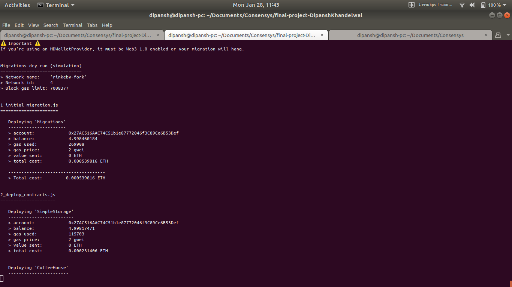
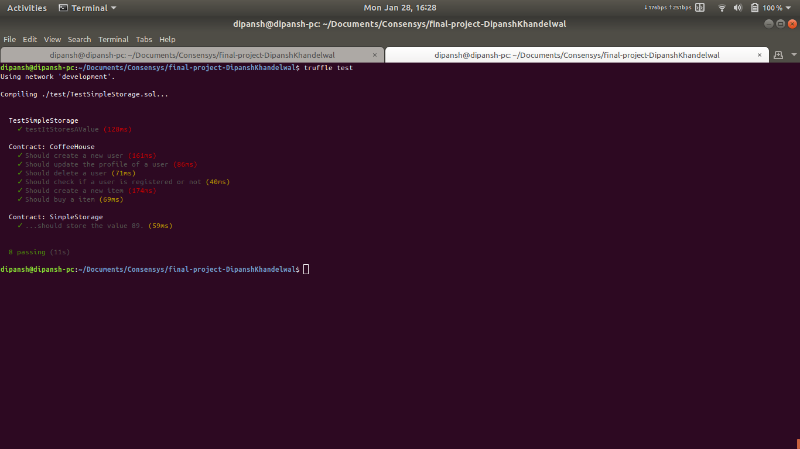
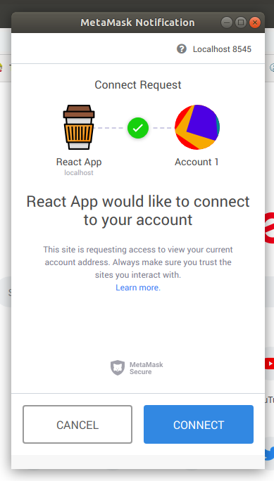
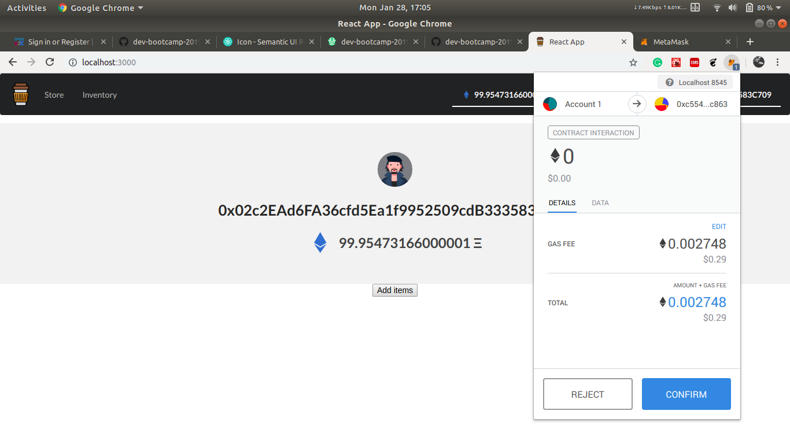
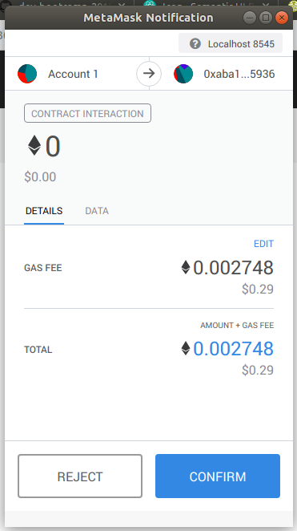
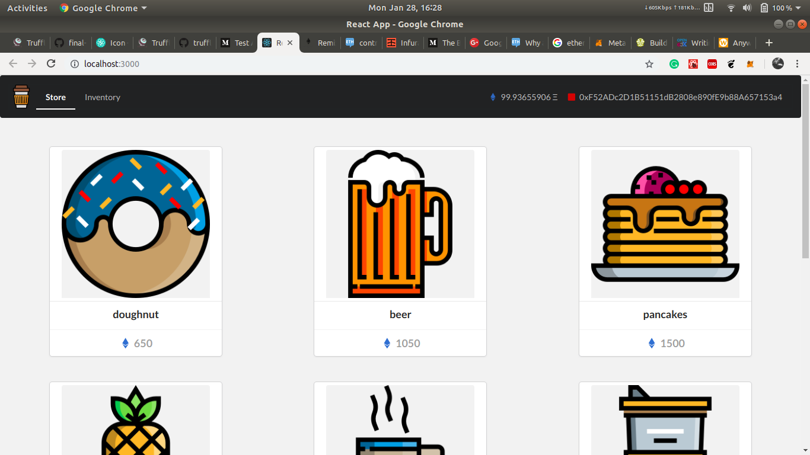
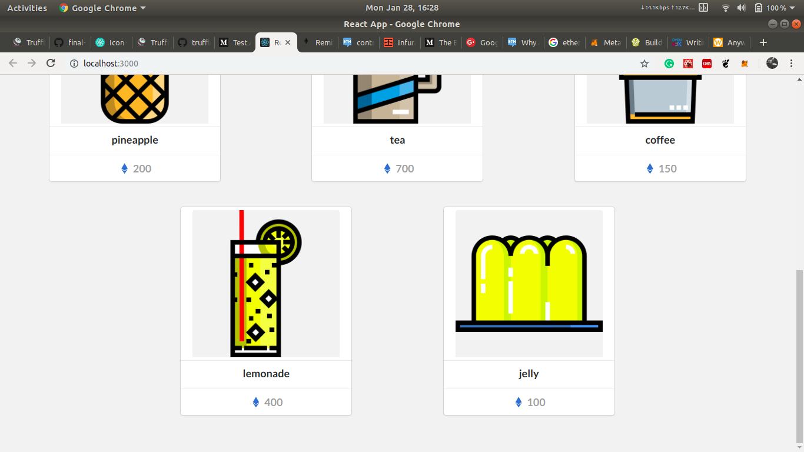
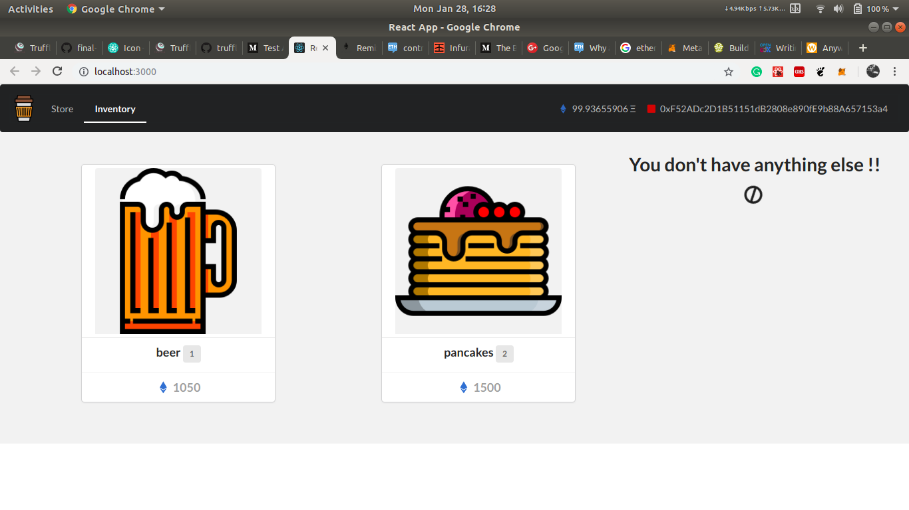

<p align="center">
  
</p>

<h1 align="center"> Coffee House </h1>

<p align="center">
  
</p>

<p align="center">Go on and ahve some decentralized coffee !!</p>

### Abstract
Coffee House is place where you can have and store your snaks and drinks. 

Buy it once !! Use it anytime !! It never ends !!

#### External Contracts Used
- OpenZeppelin SafeMath  
- OpenZeppelin Ownable


## Development

#### Prerequisites

This is my setup while developing this.
- OS: Ubuntu 18.04
- Node.js: 8.14.0
- npm: 6.5.0
- truffle: v5.0.2
- Ganache CLI: v6.2.5

#### Setup local development instance

* Clone the project locally
```
git clone https://github.com/dev-bootcamp-2019/final-project-dipanshkhandelwal
cd final-project-dipanshkhandelwal
```

* Start local development blockchain and copy the mnemonic to be used later
```
ganache-cli -b 3
```

* Compile contracts and migrate them to the blockchain
```
npm i
truffle compile
truffle migrate
```



##### Setup the frontend
The frontend is a React app that uses drizzle to interact with the contract.

```
cd client
npm i
npm start
```

### Run Tests
```
truffle test
```




### Initial setup

- Goto [localhost:3000](http://localhost:3000) and login into metamask using the mnemonic obtained from ganache.
- Allow connecting the app to web3
- Owner's account will be already created and will be the one who initiated the contract.
- You can then switch to a different metamask account and register/buy etc.





### Future work
- Better handling for users data
- Two sided store
- A more friendly page link
- Integrate drizzle-react
- Improve UI/UX

### Screenshots






<div>Icons made by <a href="https://www.freepik.com/" title="Freepik">Freepik</a> from <a href="https://www.flaticon.com/" 			    title="Flaticon">www.flaticon.com</a> is licensed by <a href="http://creativecommons.org/licenses/by/3.0/" 			    title="Creative Commons BY 3.0" target="_blank">CC 3.0 BY</a></div>


## Author

[Dipansh Khandelwal](https://github.com/dipanshkhandelwal)
[](https://github.com/dipanshkhandelwal)
[](https://linkedin.com/in/dipanshkhandelwal)
